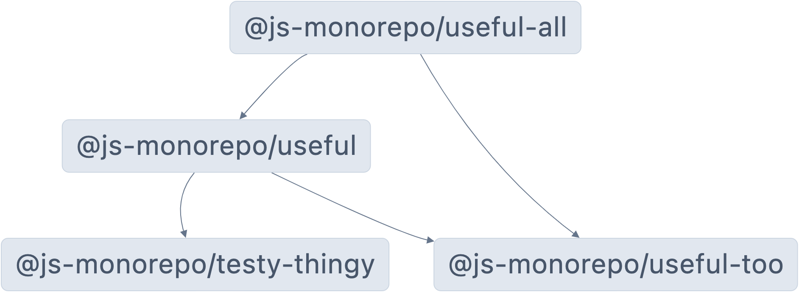

# Example Typescript Monorepo

This project represents a minimal example that uses Lerna to structure a Typescript monorepo with multiple packages and some dependencies between the packages. Shown below is the dependency graph between the packages in this project:

# Usage

- `npx lerna run build` to build all packages and their dependencies.
- `npx lerna run build --scope @js-monorepo/useful` to build just the `packages/useful` package.

# Using Packages Locally

This is mostly needed when you are making changes locally and would like to have a fast development loop to test the results of your changes.

## Within This Project

If you would like to establish a dependency between packages within this monorepo, you can add the dependency in the dependent package's `package.json` with a `*` as the version specification.

- Specifying `*` instructs Lerna that it should call the `build` script of the dependency before calling the `build` script of the dependning application.

## Externally

If you would like to establish a dependency between packages within this monorepo and an external client application that consumes these packages,

1. Run `npm link` at the root of the specific package you are making code changes in.
2. Run `npx lerna run build --scope <package>` to build that specific package.
3. In the client application, run `npm link <package> --force` to ensure that the `package.json` of the client application is updated with a `file:` link to the dependency. This effectively creates a symlink in the `node_modules` of the client application to the local dependency.

Having done this setup, this is what the development cycle looks like moving forward:

1. Make code change
2. Rebuild specific package
3. Rebuild client application.